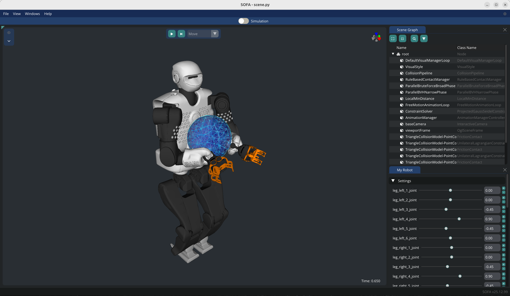
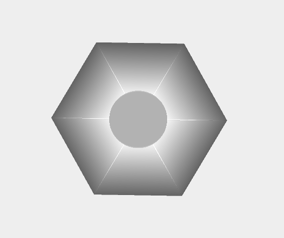
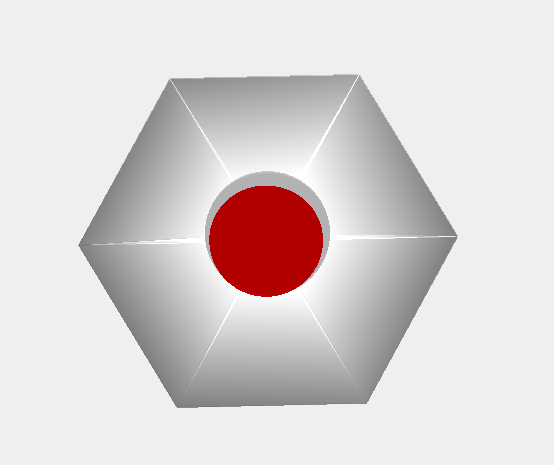
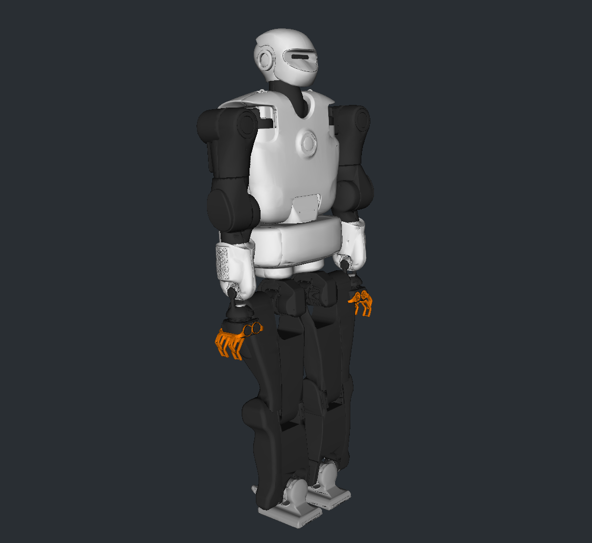
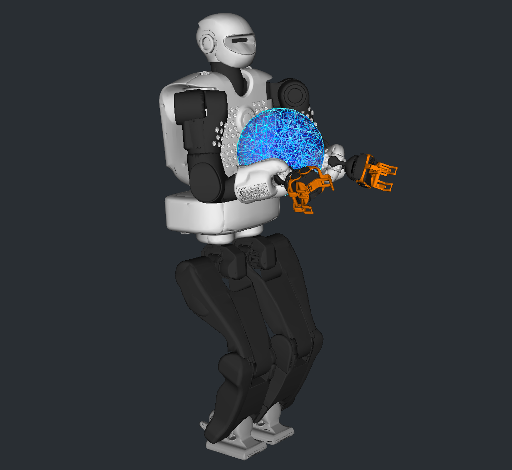
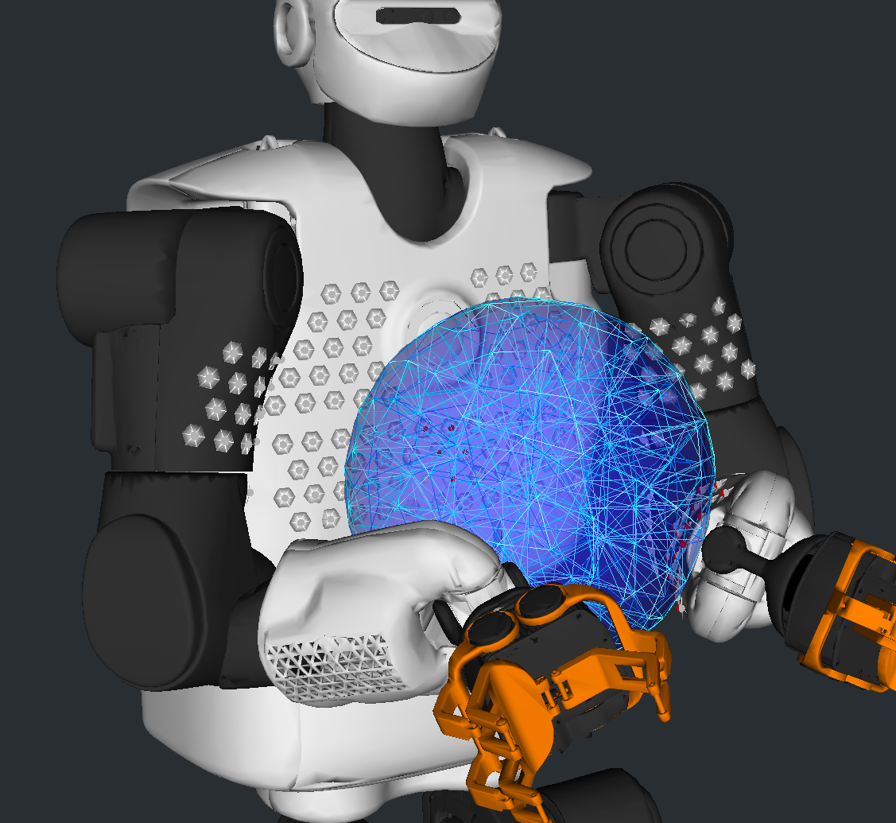

# LAAS.RobotContactSensors

Using SOFA to simulate contact sensors used to provide a skin to the TALOS humanoid robot in LAAS.

## Description of the simulation

The simulation is composed of a TALOS humanoid robot covered with contact sensors. The robot is modelled as a rigid body using the `Sofa.RigidBodyDynamics` plugin which relies on the Pinocchio library, and the `SoftRobots` plugin to solve the kinematics of the robot. 

The implementation and repository are organized as follows:
- `scene.py`: main scene file to run the simulation, the robot model and sensors with a object to interact with.
- `data/`: contains the robot urdf model and other assets used in the simulation.
- `modules/`: contains the implementation of each module used in the simulation.
- `modules/robot.py`: contains the implementation of the robot using the `Sofa.RigidBodyDynamics` plugin. The file also contains an example of scene with only the robot without sensors. You can run it by executing `runSofa -l SofaPython3,SofaImGui -g imgui modules/robot.py`.
- `modules/cell.py`: contains the implementation of a cell sensor. 

    The cell sensors are modelled using springs. Each sensor is composed of a set of eight voxels, seven are attached to the rigid via rigid links, and one (the center of the sensor) is attached to a spring that deforms when in contact with an obstacle. 

    The detection and resolution of contact are expensive operations. To optimize the simulation, we propose two strategies for the contacts:
    1. **Uncoupled contact forces**: This is the preferred method when simulating a large number of sensors. The contact forces are only detected on the center of each cell, allowing the deformable part of the cell to deform when in contact with an obstable. This method is computationally efficient but may lead to interpenetration of the robot with the environment. Plus, the contact forces are not transmitted to the robot. 
    2. **Coupled contact forces**: The contact forces are detected on all the voxels of each sensor, allowing for a transmission of the contact forces to the robot. This method is more accurate but also computationally more expensive.  
    
    The file also contains an example of scene with only the sensors. You can run it by executing `runSofa -l SofaPython3,SofaImGui -g imgui modules/cell.py`.
- `modules/cementbag.py`: contains the implementation of a cement bag object to interact with the robot. The bag is modelled as a soft body.
- `modules/ball.py`: contains the implementation of a ball object to interact with the robot. The ball is modelled as a soft body.
- `modules/patch.py`: contains the implementation of a patch of sensors. A patch is composed of multiple cells arranged in a grid or following given positions. The file also contains an example of scene with only patches of sensors. You can run it by executing `runSofa -l SofaPython3,SofaImGui -g imgui modules/patch.py`.
- `modules/utils.py`: contains utility functions used in the simulation.
- `modules/header.py`: contains the scene needed header (solvers, visual style, gravity, time step, etc.).

### Images 

#### Cell sensor, inactive and active states (red when in contact)



#### TALOS robot with patches of sensors




## Installation 

1. Clone SOFA (on the master branch): `git clone git@github.com:sofa-framework/sofa.git`
2. Compile SOFA from source following the instructions from the SOFA website: https://www.sofa-framework.org/download/. Once done test the default simulation to ensure SOFA is working correctly. In a terminal, navigate to the build directory and run: `./bin/runSofa`.
3. Clone the required plugins into a single directory e.g. `plugins`. Create the following structure:
    ```
    |-- SOFA
      |-- plugins
      |   |-- STLIB
      |   |-- SofaGLFW
      |   |-- SofaPython3
      |   |-- Sofa.RigidBodyDynamics
      |   |-- SoftRobots
      |   |-- CMakeLists.txt
      |-- build
      |-- src
    ```
    - SofaPython3:   
        `git clone git@github.com:sofa-framework/SofaPython3.git`
    - SofaGLFW (on the robotics branch):   
        `git clone git@github.com:SofaComplianceRobotics/SofaGLFW.git`  
        `git checkout robotics`
    - Sofa.RigidBodyDynamics:     
        `git clone git@github.com:olivier-roussel/Sofa.RigidBodyDynamics.git`
    - SoftRobots:  
        `git clone git@github.com:SofaDefrost/SoftRobots.git`
    - STLIB:  
        `git clone git@github.com:SofaDefrost/STLIB.git`
4. Add the plugins to SOFA by editing the `CMakeLists.txt` file in the `plugins` directory:
    ```cmake
    cmake_minimum_required(VERSION 3.10)
    sofa_add_subdirectory(plugin SofaPython3 SofaPython3 ON)
    sofa_add_subdirectory(plugin SoftRobots SoftRobots ON)
    sofa_add_subdirectory(plugin SofaGLFW SofaGLFW ON)
    sofa_add_subdirectory(plugin STLIB STLIB ON)
    sofa_add_subdirectory(plugin Sofa.RigidBodyDynamics Sofa.RigidBodyDynamics ON)
    ```
5. Add to Cmake the path to the CMakeLists.tkt file by adding the following variable: `SOFA_EXTERNAL_DIRECTORIES=PATH_TO_/plugins` 
6. Install pinocchio (to model the rigid robot):
    1. Follow installation procedure from: https://stack-of-tasks.github.io/pinocchio/download.html
    2. In CMake: `CMAKE_PREFIX_PATH = /opt/openrobots/lib/cmake/`
7. Now that the plugins have been added you can recompile SOFA.

### Python packages required:

- numpy: needed by SofaPython3
- scipy: needed by SofaPython3
- pysdf: needed to load the SDF robot model
- `pip install numpy scipy pysdf`

## How to run the simulation

1. Add SOFA to your PATH. In a terminal, run:
    ```bash
    export SOFA_ROOT=PATH_TO_SOFA/build
    export PATH=$SOFA_ROOT/bin:$PATH
    export PYTHONPATH=$SOFA_ROOT/lib/python3/site-packages
    export PYTHONPATH=$PYTHONPATH:PATH_TO_THIS_REPOSITORY
    ```
2. In the same terminal, launch the simulation by running:
    ```bash
    runSofa -l SofaPython3,SofaImGui -g imgui scene.py
    ```
